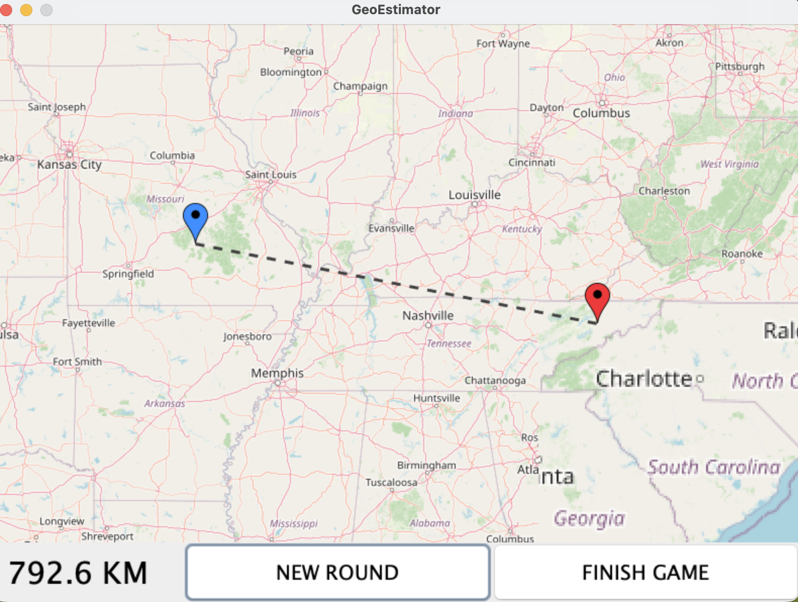

# GeoEstimator

GeoEstimator is a Java-based geography guessing and visualization game that analyzes geographic data to render maps, paths, and interactive panoramas. The project focuses on modular design, event-driven logic, and clean separation of concerns.

## Gameplay Examples

  <em>Example of a panorama that the user explores to observe details and make an informed geographic guess.</em>

  

 

  <em>Examples of local and long-distance location estimation with the blue pin being the guess and the red pin the actual location.</em>

  
  

